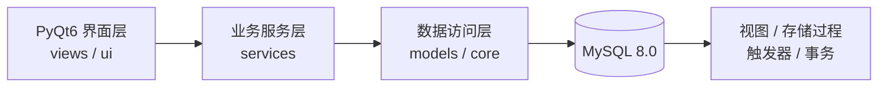

# 教务管理系统

[](https://github.com/XuanhaoChang/academic-management-system/actions/workflows/ci.yml)
[](https://www.python.org/)
[](https://www.mysql.com/)
[](LICENSE)

一个基于 Python、PyQt6 与 MySQL 的桌面教务管理系统，覆盖管理员、教师、学生三类角色，并通过视图、存储过程、触发器和事务实现完整的教学业务闭环。

## 功能亮点

- 管理员端：用户、院系、专业、课程、开课、调课与缓考审批管理。
- 教师端：成绩录入与提交、平时分管理、统计分析、挂科预警、归档和 Excel 导出。
- 学生端：选课、退课、候补递补、课表、成绩、考试、缓考申请和课程评教。
- 数据库能力：21 张核心业务表、统计视图、存储过程、触发器、审计日志和软删除。
- 工程化能力：连接池、分层架构、参数化查询、统一异常处理和自动化语法检查。

## 系统架构



详细设计见 [架构文档](docs/architecture.md)，数据库关系可在 [DBML 图谱](docs/schema.dbml) 中查看。

## 快速开始

### 1. 环境要求

- Python 3.10+
- MySQL 8.0+
- Windows、Linux 或 macOS 桌面环境

### 2. 安装依赖

```bash
git clone https://github.com/XuanhaoChang/academic-management-system.git
cd academic-management-system
python -m venv .venv
```

Linux/macOS：

```bash
source .venv/bin/activate
pip install -r requirements.txt
```

Windows PowerShell：

```powershell
.venv\Scripts\Activate.ps1
pip install -r requirements.txt
```

### 3. 配置数据库

复制配置模板并按需修改：

```bash
cp config.example.ini config.ini
```

Windows PowerShell：

```powershell
Copy-Item config.example.ini config.ini
```

模板中的数据库账号和密码仅用于本地演示。公开部署前请更换密码，并限制 MySQL 的可访问来源。

### 4. 初始化数据库

`sql/00_setup.sql` 会删除并重建同名数据库，请勿对已有业务数据库执行。

```bash
mysql -u root -p < sql/00_setup.sql
python init_database.py
python -m scripts.teacher.setup_procedures
```

如需完整演示数据，可继续按编号执行 `sql/07_teacher_demo_data.sql` 至 `sql/11_student_mock_alignment.sql`。

### 5. 启动应用

```bash
python main.py
```

本地演示账号：

| 角色 | 用户名 | 密码 |
| --- | --- | --- |
| 管理员 | `admin` | `admin123` |
| 教师 | `teacher01` | `teacher123` |
| 学生 | `stu001` | `student123` |

## 项目结构

```text
.
├── core/                  # 数据库连接、会话、异常与日志
├── models/                # 数据访问与统计查询
├── services/              # 业务逻辑
├── views/                 # 主窗口与页面装配
├── ui/                    # 管理员、教师等界面组件
├── sql/                   # 按执行顺序编号的数据库脚本
├── scripts/               # 教师端、学生端辅助脚本
├── examples/              # 演示导入文件
├── docs/                  # 架构与数据库参考资料
├── init_database.py       # 数据库初始化入口
└── main.py                # 应用入口
```

## 文档

- [系统架构](docs/architecture.md)
- [数据库 DBML 图谱](docs/schema.dbml)
- [贡献指南](CONTRIBUTING.md)
- [安全说明](SECURITY.md)

## 开发与验证

```bash
python -m compileall -q .
python -m pytest -q
```

当前自动化测试覆盖配置读取和无数据库依赖的核心逻辑；完整 GUI 与数据库流程仍需在本地 MySQL 环境中验证。

## License

本项目采用 [MIT License](LICENSE) 开源。
