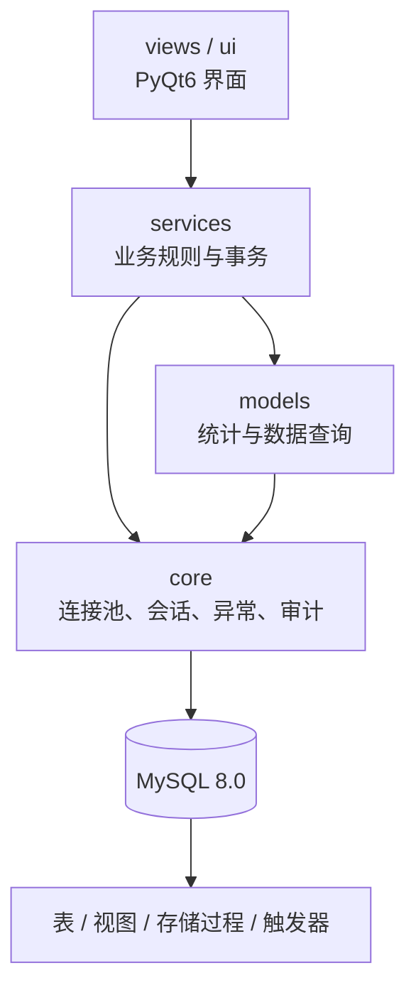

# 软件架构说明

## 总览

系统采用桌面界面、业务服务、数据访问和 MySQL 数据库四层结构。界面层不直接拼接 SQL；跨表写操作由服务层组织，并通过数据库事务保证一致性。

## 代码目录

| 目录 | 职责 |
| --- | --- |
| `core/` | 数据库配置、连接池、会话、常量、领域异常和审计日志 |
| `models/` | 成绩分析、排名和归档等查询封装 |
| `services/` | 认证、管理员、教师、学生、成绩和选课业务 |
| `views/` | 登录窗口、主窗口和学生端页面 |
| `ui/` | 管理员与教师端可复用界面组件和主题 |
| `sql/` | 数据库结构、视图、过程、触发器和演示数据 |
| `scripts/` | 数据初始化、演示和维护工具 |
| `tests/` | 不依赖 GUI 或真实数据库的自动化测试 |

## 数据库模型

数据库包含 21 张核心业务表，分为三个领域：

- 系统与组织：`sys_roles`、`sys_permissions`、`sys_role_permissions`、`sys_users`、`sys_audit_logs`、`sys_config`、`base_dept`、`base_major`。
- 教学与成绩：`edu_courses`、`edu_teaching`、`edu_grades`、`edu_archives`、`edu_daily_records`、`edu_schedule_change_req`。
- 学生业务：`stu_info`、`stu_selection`、`stu_waiting_list`、`stu_course_prereq`、`stu_exam_schedule`、`stu_exam_defer_req`、`stu_evaluation`。

完整字段和关系见 [数据库 DBML 图谱](schema.dbml)，实际结构以 `sql/` 中的脚本为准。

### 数据库对象

统计视图：

- `view_class_ranking`：课程成绩与排名。
- `view_grade_stats`：教学班成绩统计。
- `view_student_gpa`：学生 GPA 汇总。
- `view_teacher_schedule`：教师课表。
- `view_daily_score`：平时成绩汇总。

存储过程：

- `proc_archive_grades`：归档指定学期的成绩。
- `proc_submit_grades`：校验并锁定教学班成绩。
- `proc_attempt_enroll`：处理选课容量与候补逻辑。

触发器：

- 用户新增或更新时写入审计日志。
- 成绩提交时写入审计日志。
- 退课时同步教学班人数和开放状态。

## 关键业务流程

### 登录与角色导航

1. `LoginDialog` 将用户名和密码交给 `AuthService`。
2. `AuthService` 校验用户并写入 `Session`。
3. `MainWindow` 根据管理员、教师或学生角色加载对应页面。

### 选课、退课与候补

1. `CourseValidator` 校验先修课、时间冲突、考试冲突和学生范围。
2. `SelectionService` 在事务中锁定目标教学班。
3. 有容量时创建选课记录；满员时创建候补记录。
4. 退课后按队列顺序递补，并同步教学班人数。

### 成绩管理

1. 教师录入平时成绩和卷面成绩。
2. `GradeService` 计算最终成绩、绩点、等级和通过状态。
3. 提交前由存储过程检查缺失成绩，提交后锁定教学班。
4. 历史成绩可归档至 `edu_archives`。

## 数据一致性约定

- 应用查询使用参数化 SQL，禁止拼接用户输入。
- 多表写操作使用 `DBManager.transaction()`。
- 业务删除默认采用软删除字段。
- 选课与候补的有效记录以 `deleted_at = 0` 为准。
- 关键变更通过 `sys_audit_logs` 留下审计记录。
- 当前学期由 `sys_config` 管理。

## 初始化顺序

首次运行先使用管理员账号执行 `sql/00_setup.sql`，然后运行 `python init_database.py`。初始化入口按以下顺序加载基础对象：

1. `sql/01_init_schema.sql`
2. `sql/02_views.sql`
3. `sql/03_procedures.sql`
4. `sql/04_triggers.sql`
5. `sql/05_test_data.sql`
6. `sql/06_teacher_ext.sql`
7. `sql/08_student_ext.sql`

`sql/07_*`、`sql/09_*` 至 `sql/11_*` 用于补充演示数据，可按需要单独执行。
