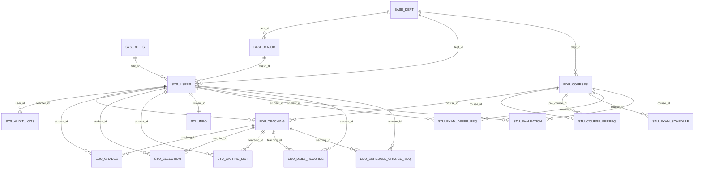

# 数据库架构设计说明（Human + Agent）

更新时间：2026-03-31  
数据库：`my_db_project`  
事实来源（Source of Truth）：
- `sql/01_init_schema.sql`
- `sql/02_views.sql`
- `sql/03_procedures.sql`
- `sql/04_triggers.sql`
- `sql/06_teacher_ext.sql`
- `sql/08_student_ext.sql`
- `init_database.py`

---

## 1. Agent 快速索引（Machine-friendly）

```yaml
schema_manifest:
  database: my_db_project
  charset: utf8mb4
  object_counts:
    tables: 21
    views: 5
    procedures: 3
    triggers: 4
  modules:
    base_rbac:
      - sys_roles
      - sys_permissions
      - sys_role_permissions
      - sys_users
      - sys_audit_logs
      - sys_config
      - base_dept
      - base_major
    teaching_grade:
      - edu_courses
      - edu_teaching
      - edu_grades
      - edu_archives
      - edu_daily_records
      - edu_schedule_change_req
    student_selection:
      - stu_info
      - stu_selection
      - stu_waiting_list
      - stu_course_prereq
      - stu_exam_schedule
      - stu_exam_defer_req
      - stu_evaluation
  key_business_objects:
    enrollment_core: [stu_selection, stu_waiting_list, edu_teaching]
    score_core: [edu_grades, edu_daily_records, edu_archives]
    approval_core: [edu_schedule_change_req, stu_exam_defer_req]
```

---

## 2. 逻辑分层与职责

1. 基础与权限层（RBAC + 基础数据）
- 用户、角色、权限、审计日志、院系专业、系统配置。
- 代表表：`sys_users`、`sys_roles`、`sys_permissions`、`sys_role_permissions`、`sys_audit_logs`、`base_dept`、`base_major`、`sys_config`。

2. 教学与成绩层
- 课程、开课班（教学班）、成绩、归档、平时记录、调课申请。
- 代表表：`edu_courses`、`edu_teaching`、`edu_grades`、`edu_archives`、`edu_daily_records`、`edu_schedule_change_req`。

3. 学生业务层
- 学生扩展、选课/候补、先修关系、考试安排、缓考、评教。
- 代表表：`stu_info`、`stu_selection`、`stu_waiting_list`、`stu_course_prereq`、`stu_exam_schedule`、`stu_exam_defer_req`、`stu_evaluation`。

---

## 3. 核心实体关系（ER）

术语澄清：
- `teacher_id`：教师用户ID（`sys_users.id`）。
- `teaching_id`：教学班实例ID（`edu_teaching.id`），表示“某门课在某学期由某教师在某时间地点开的一个班”。
- 结论：选课与成绩绑定 `teaching_id` 是绑定“教学班实例”，不是绑定“教师”。



---

## 4. 数据库对象清单

### 4.1 Tables（21）

1. RBAC/基础：
- `sys_roles`
- `sys_permissions`
- `sys_role_permissions`
- `base_dept`
- `base_major`
- `sys_users`
- `sys_audit_logs`
- `sys_config`

2. 教学/成绩：
- `edu_courses`
- `edu_teaching`
- `edu_grades`
- `edu_archives`
- `edu_daily_records`
- `edu_schedule_change_req`

3. 学生业务：
- `stu_selection`
- `stu_waiting_list`
- `stu_info`
- `stu_course_prereq`
- `stu_exam_schedule`
- `stu_exam_defer_req`
- `stu_evaluation`

### 4.2 Views（5）
- `view_class_ranking`：课程内/课程级/学期级排名与绩点分段。
- `view_grade_stats`：教学班成绩统计。
- `view_student_gpa`：学生加权 GPA 汇总。
- `view_teacher_schedule`：教师课表总览。
- `view_daily_score`：平时分汇总（按完成率映射 30 分）。

### 4.3 Stored Procedures（3）
- `proc_attempt_enroll`：并发选课入口（`sql/08_student_ext.sql` 中重建为增强版本）。
- `proc_archive_grades`：按学期归档成绩并软删除主表记录。
- `proc_submit_grades`：提交并锁定班级成绩。

### 4.4 Triggers（4）
- `trigger_audit_log_sys_users_update`
- `trigger_audit_log_sys_users_insert`
- `trigger_auto_fill_vacancy`（在 `sql/08_student_ext.sql` 中被安全版覆盖）
- `trg_after_grade_submit`

---

## 5. 关键业务链路（按数据库对象）

1. 选课链路
- 入口：`proc_attempt_enroll`
- 核心表：`stu_selection` + `edu_teaching`
- 容量口径：实时 `COUNT(stu_selection)` 对比 `edu_teaching.max_count`
- 状态同步：更新 `edu_teaching.enrolled_count` 与 `status`

2. 退课与候补链路
- 退课后 `stu_selection.deleted_at > 0`（毫秒时间戳，`0` 表示有效）
- 触发器 `trigger_auto_fill_vacancy` 仅做人数与状态轻量同步
- 真正递补由服务层事务执行（避免触发器内二次写同表导致死锁）

3. 成绩链路
- 教师录入：`edu_grades.exam_score` + `view_daily_score.daily_score` 形成 `score`
- 提交锁定：`proc_submit_grades` -> `edu_teaching.is_submitted = 1`
- 审计：`trg_after_grade_submit` 写 `sys_audit_logs`

4. 归档链路
- `proc_archive_grades(semester)`
- 将 `edu_grades` 快照写入 `edu_archives`
- 主表成绩逻辑删除（`edu_grades.is_deleted = 1`）

---

## 6. 当前设计优点

1. 分层清晰
- RBAC、教学成绩、学生业务边界明确，便于多人并行开发。

2. 软删除一致性较好
- 关键业务表统一软删除语义（选课/候补采用 `deleted_at`，其余模块沿用 `is_deleted`），支撑“可恢复”与审计。

3. SQL 能力覆盖课程设计高分点
- 视图、触发器、存储过程、窗口函数、事务协同均有落地。

4. 并发选课口径已修正
- 以实时计数替代脏缓存字段，降低超卖风险。

---

## 7. 冗余现状与结论（明确版）

结论：**当前结构存在冗余**，且是“有意冗余 + 风险冗余”并存，不是“零冗余设计”。

### 7.1 有意冗余（可接受，但要文档化）

1. `edu_archives` 与在线成绩信息重复
- 说明：归档表保存历史快照，字段与在线成绩存在重复。
- 判断：这是典型审计/历史保留冗余，可接受。
- 前提：必须明确“归档只追加，不回写覆盖现网”。

2. `edu_teaching.enrolled_count`/`status` 可由选课记录推导
- 说明：本质可从 `stu_selection` 计算。
- 判断：这是性能缓存型冗余，可接受。
- 前提：只能有一个权威更新入口，避免写偏。

### 7.2 风险冗余（建议收敛）

3. 同名过程/触发器在多个 SQL 重复定义
- 对象：`proc_attempt_enroll`、`trigger_auto_fill_vacancy`。
- 风险：初始化顺序变化会导致最终行为变化，属于高风险冗余。

4. 成绩衍生值若落库会与规则演进冲突
- 说明：`score` 是核心值，其他等级/绩点若持久化会与评分规则变更产生不一致。
- 风险：历史数据语义漂移。

5. 审批流结构重复
- 对象：`edu_schedule_change_req` 与 `stu_exam_defer_req`。
- 风险：状态、处理人、意见等字段语义平行但未统一，后续扩展成本高。

### 7.3 一句话策略

- 保留“快照冗余、缓存冗余”。
- 收敛“定义冗余、语义冗余”。

---

## 8. 结构改进建议（按优先级）

执行状态（2026-03-31）：P0 三项已在 SQL 脚本层完成落地。
说明：触发器重建在部分 MySQL 环境需要管理员开启 `log_bin_trust_function_creators=1` 或使用更高权限账号执行。

### P0（建议优先在课程答辩前完成）

1. 统一“同名对象多处定义”策略
- 现状：`proc_attempt_enroll` 与 `trigger_auto_fill_vacancy` 在多个 SQL 文件定义并被覆盖。
- 风险：初始化顺序变动会导致行为漂移。
- 建议：
  - 只保留“最终版定义”在一个文件（例如 `08_student_ext.sql`），旧定义改名为 `_legacy` 或移除。
  - 在文档中明确“覆盖关系与最终生效版本”。

2. 为关键查询补齐复合索引
- 场景：按 `teaching_id + deleted_at` 查选课人数、按 `teacher_id + status` 查审批列表。
- 建议示例：
  - `stu_selection(teaching_id, deleted_at, student_id)`
  - `stu_waiting_list(teaching_id, deleted_at, queue_no)`
  - `edu_grades(teaching_id, is_deleted, student_id)`
  - `edu_schedule_change_req(status, is_deleted, created_at)`

3. 增加关键字段值域约束
- 现状：部分分数与容量依赖应用层保证。
- 建议：
  - `exam_score`、`score` 限定 0-100。
  - `max_count` 限定 > 0。
  - 使用 CHECK（MySQL 8.0+）或触发器兜底。

### P1（建议在下一轮迭代完成）

4. 评估将选课主键统一到 `teaching_id`（保持当前方向）
- 现状：当前已是 `stu_selection.teaching_id`，方向正确。
- 关键澄清：`teaching_id` 不是 `teacher_id`。一个老师可以在 `edu_teaching` 中拥有多条记录（多门课/同门课多教学班），因此并不存在“一个老师只能教一门课”的限制。
- 建议：
  - 所有学生业务优先关联 `teaching_id`（教学班实例）。
  - 在展示层通过 `edu_teaching.teacher_id` + `edu_teaching.course_id` 回显教师与课程信息。
  - 为降低命名歧义，可在下一版将 `teaching_id` 重命名为 `offering_id`（仅命名优化，不改变建模语义）。

5. 学期维度治理（不强制建立独立学期表）
- 结论：学期/学年按规则流动的项目中，可不单独建立 `term` 字典表，避免低价值冗余。
- 最小治理建议：
  - 统一使用 `semester`/`term_code`（如 `2025-2026-1`）作为业务时间维度字段。
  - 在 `sys_config` 维护 `current_semester`、窗口期配置（选课起止时间）。
  - 关键流程统一按当前学期过滤，避免时间规则散落在应用层。

6. 归档表语义文档化
- `edu_archives` 目前是快照语义（反规范化可接受）。
- 建议：在注释与文档明确“归档后不回写、不逆向覆盖现网数据”。
- 归档不变量（建议写入团队规范）：
  - 只允许追加归档记录，不允许更新历史快照业务值。
  - 查询历史以 `edu_archives` 为准，不再回推改写 `edu_grades`。
  - 恢复流程必须是“新写入在线表”，而不是覆盖归档表。

7. 审计日志可分层
- 当前 `sys_audit_logs.detail` 为文本，灵活但难检索。
- 建议新增 `biz_key`、`biz_type`、`trace_id`（可空），便于筛查与链路追踪。
- 推荐分层：
  - 通用层：`action_type`、`user_id`、`created_at`。
  - 业务层：`biz_type`（如 ENROLL/GRADE/APPROVAL）、`biz_key`（如 teaching_id=12）。
  - 链路层：`trace_id`（同一事务/请求全链路关联）。

### P2（中长期优化）

8. 统一审批中心模型
- 现有 `edu_schedule_change_req` 与 `stu_exam_defer_req` 均是审批流。
- 可考虑抽象公共字段（状态、处理人、意见、处理时间）形成统一规范或基类表。

9. 增加迁移脚本机制
- 当前以 SQL 顺序初始化为主。
- 建议增量迁移目录（如 `sql/migrations/`）并记录版本号，避免多人协作时“全量重建”成本过高。

---

## 9. 初始化顺序与生效说明

`init_database.py` 当前执行顺序：
1. `00_setup.sql`
2. `01_init_schema.sql`
3. `02_views.sql`
4. `03_procedures.sql`
5. `04_triggers.sql`
6. `05_test_data.sql`
7. `06_teacher_ext.sql`
8. `08_student_ext.sql`

说明：
- `08_student_ext.sql` 中会 `DROP + CREATE` 增强版 `proc_attempt_enroll` 与 `trigger_auto_fill_vacancy`，因此最终生效行为以该文件为准。

---

## 10. Agent 读取建议

如果由 Agent 自动理解本库，建议按以下顺序读取：
1. 本文（对象总览与覆盖关系）
2. `sql/01_init_schema.sql`（基础实体）
3. `sql/06_teacher_ext.sql` + `sql/08_student_ext.sql`（扩展与最终行为）
4. `sql/02_views.sql`（分析口径）
5. `sql/03_procedures.sql` + `sql/04_triggers.sql`（历史定义与兼容层）

---

## 11. 已实施变更清单（2026-03-31）

1. P0-1 同名对象单一来源
- [sql/03_procedures.sql](sql/03_procedures.sql)：移除重复 `proc_attempt_enroll` 定义，仅保留 `proc_archive_grades`。
- [sql/04_triggers.sql](sql/04_triggers.sql)：移除重复 `trigger_auto_fill_vacancy` 定义，仅保留系统审计触发器。
- [sql/08_student_ext.sql](sql/08_student_ext.sql)：作为 `proc_attempt_enroll` 与 `trigger_auto_fill_vacancy` 最终生效定义。

2. P0-2 复合索引落地
- [sql/01_init_schema.sql](sql/01_init_schema.sql)：新增 `idx_sel_teaching_del_student`、`idx_wait_teaching_del_queue`、`idx_grades_teaching_del_student`。
- [sql/06_teacher_ext.sql](sql/06_teacher_ext.sql)：补齐 `idx_req_status_del_created` 及历史库兼容补丁。
- [sql/08_student_ext.sql](sql/08_student_ext.sql)：补齐历史库索引兼容补丁。

3. P0-3 值域约束落地
- [sql/01_init_schema.sql](sql/01_init_schema.sql)：新增 `ck_teaching_max_count_pos`、`ck_grade_exam_score_range`、`ck_grade_score_range`。
- [sql/06_teacher_ext.sql](sql/06_teacher_ext.sql)：为历史库提供 CHECK 约束兼容补丁。

4. 语义澄清（避免 `teaching_id` 与 `teacher_id` 混淆）
- [DATABASE_ARCHITECTURE.md](DATABASE_ARCHITECTURE.md)：补充术语澄清与建模解释。
- [sql/01_init_schema.sql](sql/01_init_schema.sql)、[sql/08_student_ext.sql](sql/08_student_ext.sql)：将相关 `teaching_id` 列注释明确为“教学班ID，非教师ID”。

5. 软删除语义升级与学期维度结论收敛
- [sql/01_init_schema.sql](sql/01_init_schema.sql)：`stu_selection`、`stu_waiting_list` 新增 `deleted_at`（毫秒时间戳，`0` 表示有效），唯一键/索引改为基于 `deleted_at`。
- [sql/08_student_ext.sql](sql/08_student_ext.sql)：新增历史库兼容迁移（补列、清理旧唯一索引、重建唯一键/索引），并将 `proc_attempt_enroll` 与触发器条件切换至 `deleted_at`。
- [services/student_selection_impl.py](services/student_selection_impl.py)、[services/student_service.py](services/student_service.py)、[services/teacher_service.py](services/teacher_service.py)、[services/grade_service.py](services/grade_service.py)、[services/validator.py](services/validator.py)：选课/候补读写统一改为 `deleted_at=0` 语义。
- [DATABASE_ARCHITECTURE.md](DATABASE_ARCHITECTURE.md)：明确“学期维度不强制建独立表，采用 `semester/term_code + sys_config` 最小治理”。
